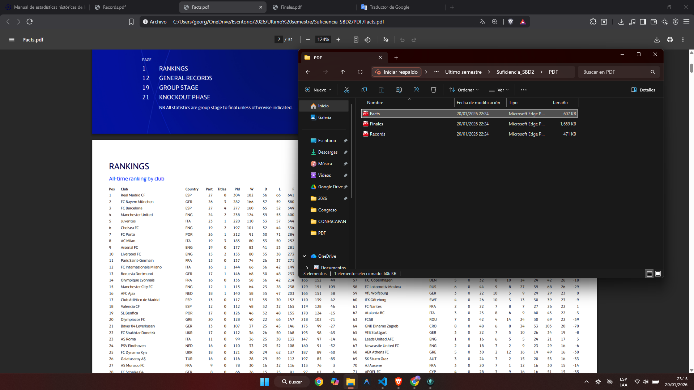
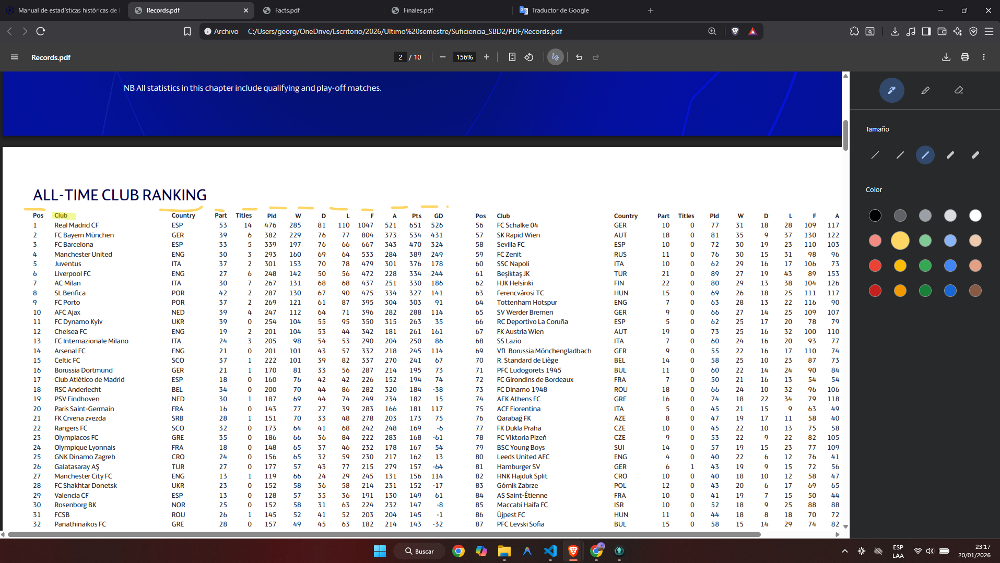
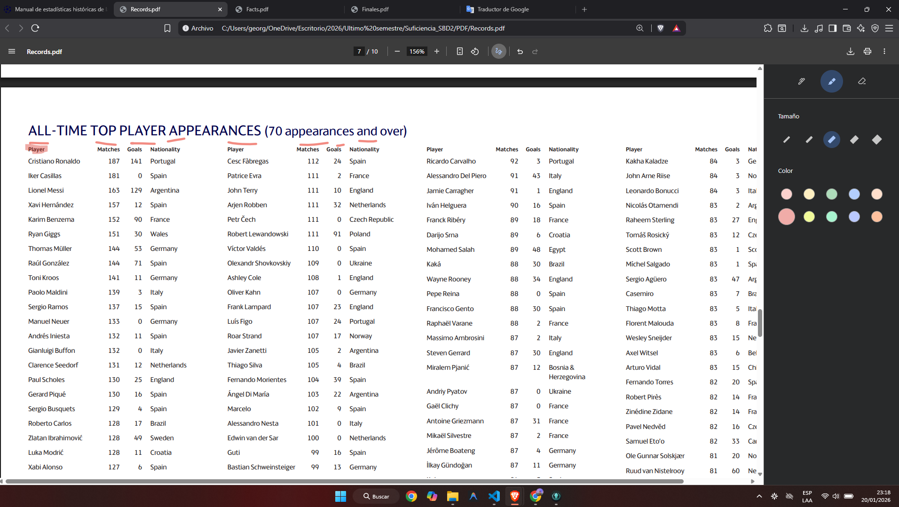
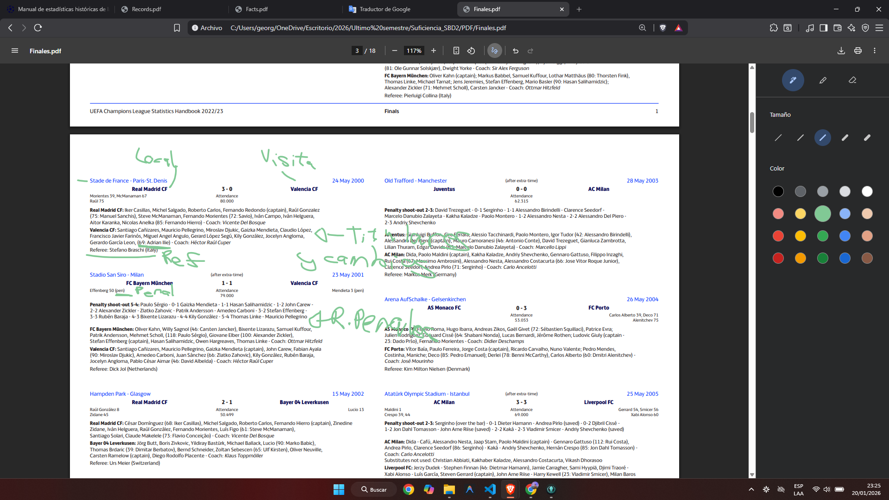
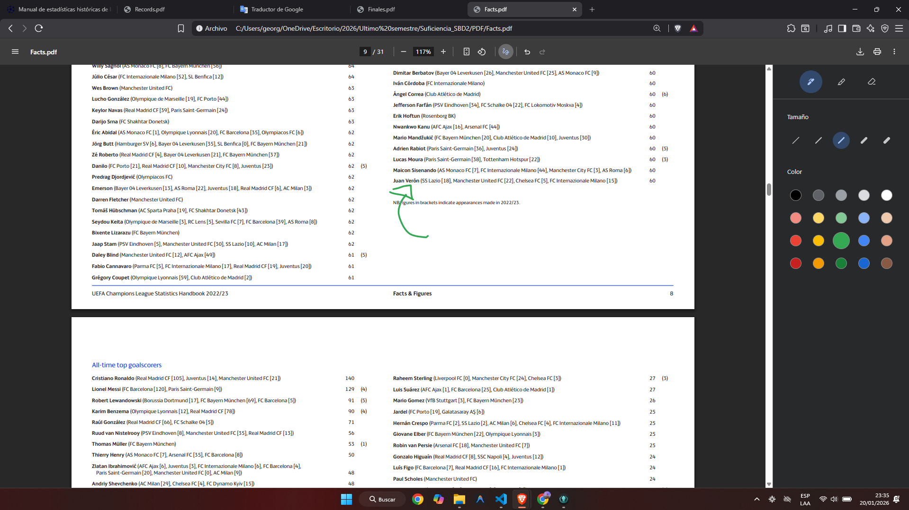
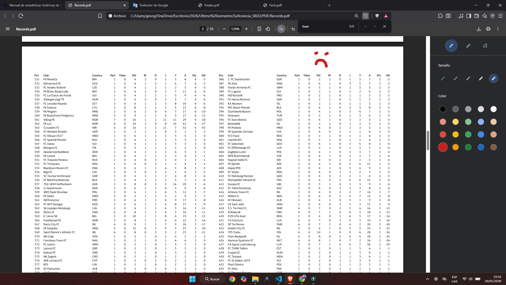

# Documentación de Proyecto: Suficiencia Bases de Datos 2
**Estudiante:** Jorge Alejandro De León Batres
**Carnet:** 202111277

---

## 1. Modelo Conceptual

### Fuentes Analizadas:

1.  **Records.pdf:** Contiene rankings históricos. Se detecta información de clubes y jugadores.

2.  **Finales.pdf:** Se observa información de partidos, estadios, arbitros, equipos locales, visitantes, rondas de penales, alineacionese y cambios.

3. **Facts.pdf**: 

---

## 2. Normalización

Para garantizar la integridad de los datos y evitar redundancia, se transformó el modelo simple en un modelo relacional normalizado (hasta 3FN).

### Paso 1: Separación de Catálogos (1FN - Eliminar grupos repetidos)
Inicialmente, un partido en el PDF tiene repetidos los nombres de los estadios y los clubes.
* **Acción:** Se extraen `ESTADIO`, `CLUB` y `PAIS` como entidades independientes.
* **Acción:** Se crea un catálogo único de `JUGADORES` unificando a los goleadores de los récords con los jugadores de las alineaciones.

### Paso 2: Relaciones Muchos a Muchos (2FN y 3FN)
Un partido tiene muchos jugadores, y un jugador juega muchos partidos. Un partido tiene muchos eventos (goles, cambios).
* **Acción:** Se crean tablas intermedias `ALINEACION` (Match_Players) y `EVENTO_PARTIDO`.

> 📷 **[PEGAR SCREENSHOT AQUÍ: Captura de tu herramienta de diagramado (ej: Draw.io, Workbench, DataGrip) mostrando las tablas desconectadas o en borrador]**
> *Descripción: Borrador inicial de las entidades identificadas.*

---

## 3. Diccionario de Datos (Modelo Físico Final)

A continuación, se detalla la estructura final de la base de datos SQL propuesta.

### 3.1 Entidades principales

#### Tabla: `PAIS`
* `id_pais` (PK, VARCHAR 3)
* `nombre_pais` (VARCHAR)

#### Tabla: `ESTADIO`
* `id_estadio` (PK, INT, Auto)
* `nombre` (VARCHAR)
* `ciudad` (VARCHAR)

#### Tabla: `CLUB`
* `id_club` (PK, INT, Auto)
* `nombre_oficial` (VARCHAR)
* `id_pais` (FK -> PAIS)

#### Tabla: `JUGADOR`
* `id_jugador` (PK, INT, Auto)
* `nombre_completo` (VARCHAR)
* `nacionalidad` (FK -> PAIS, Opcional)

*Nota: durante el analisis se identificó que los jugadores no tenian nacionalidad ne el pdf de records, entonces si aparecian en el listado de records, y no en el de Facts, se quedarían sin una nacionalidad asignada, por eso se dejó como opcional este campo*

### 3.2 Entidades transaccionales 

#### Tabla: `PARTIDO_FINAL`

* `id_partido` (PK, INT, Auto)
* `temporada` (VARCHAR 9) - Ej: "1992/93"
* `fecha` (DATE)
* `id_estadio` (FK -> ESTADIO)
* `asistencia` (INT)
* `resultado_local` (INT)
* `resultado_visita` (INT)
* `tipo_definicion` (ENUM: 'Regular', 'ExtraTime', 'Penalties')

### 3.3 Tablas de Detalle y Relación

#### Tabla: `PARTIDO_EQUIPO`

* `id_partido` (FK)
* `id_club` (FK)
* `rol` (VARCHAR) - 'Local' o 'Visita'
* `nombre_entrenador` (VARCHAR)

*Nota: Se decidió no hacer tabla de entrenadores por simplicidad en la extracción.*

#### Tabla: `ALINEACION`
* `id_partido` (FK)
* `id_club` (FK)
* `id_jugador` (FK)
* `es_titular` (BOOLEAN)
* `posicion` (VARCHAR 5) - Ej: GK, DEF
* `es_capitan` (BOOLEAN)

#### Tabla: `EVENTO`
* `id_evento` (PK, INT, Auto)
* `id_partido` (FK)
* `id_jugador` (FK)
* `minuto` (INT)
* `tipo_evento` (ENUM: 'GOL', 'TARJETA_A', 'TARJETA_R', 'CAMBIO_IN', 'CAMBIO_OUT')

---

## 4. Tablas estadísticas 

#### Tabla: `RANKING_CLUB_HISTORICO`
* `id_club` (FK)
* `partidos_jugados` (INT)
* `victorias` (INT)
* `goles_favor` (INT)
* `titulos` (INT)

#### Tabla: `RECORD_JUGADOR`
* `id_jugador` (FK)
* `total_apariciones` (INT)
* `total_goles` (INT)

---